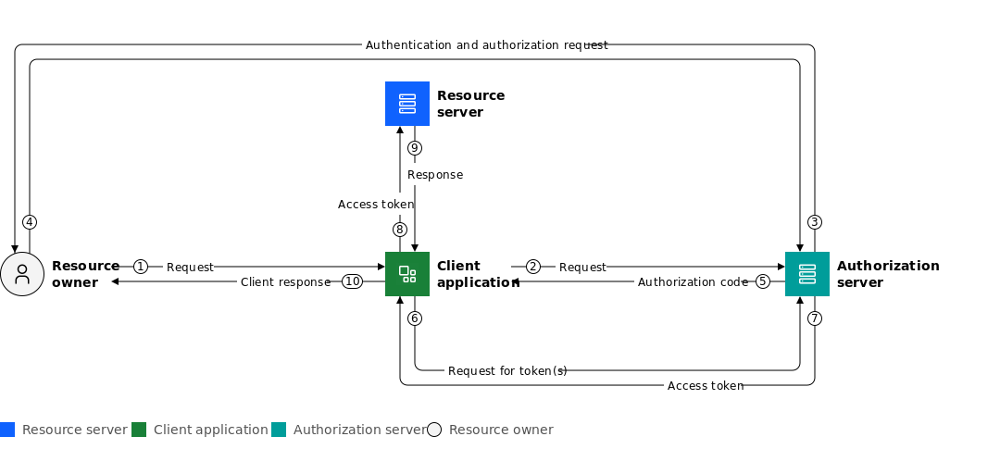

# OAuth 2.0. Autorización Delegada

## Índice

- [1. Introducción](#1-introducción)
- [2. Flujos de OAuth 2.0](#2-flujos-de-oauth-20)
- [3. Diagrama del flujo de código de autorización](#3-diagrama-del-flujo-de-código-de-autorización)
- [4. OAuth Playground](#4-oauth-playground)
- [5. Cómo crear una OAuth App en GitHub](#5-cómo-crear-una-oauth-app-en-github)
- [6. GitHub OAuth Scopes](#6-github-oauth-scopes)
- [7. Cómo ejecutar la aplicación de ejemplo](#7-cómo-ejecutar-la-aplicación-de-ejemplo)
- [8. Referencias](#8-referencias)

## 1. Introducción

**OAuth 2.0** es un estándar abierto que permite la **autorización delegada**. Su objetivo es permitir que una aplicación de terceros (el *cliente*) acceda a información protegida que está almacenada en un servidor, **sin que el usuario tenga que compartir sus credenciales** con esa aplicación.

La especificación de OAuth 2.0 define varios roles fundamentales:

### **Cliente**

La aplicación que solicita acceso a un recurso protegido en nombre del usuario.

### **Propietario del recurso**

La entidad que posee el recurso protegido y que concede el permiso de acceso. Normalmente es el usuario final.

### **Servidor de autorización**

El servidor encargado de autenticar al propietario del recurso y emitir los *tokens de acceso*.

### **Servidor de recursos**

El servidor donde están almacenados los recursos protegidos a los que el cliente quiere acceder.

## 2. Flujos de OAuth 2.0

OAuth 2.0 se basa en **tokens de acceso** para otorgar autorización.
Un token de acceso representa el permiso concedido a una aplicación para actuar en nombre del usuario.

Para obtener estos tokens, existen varios **flujos (grant types)**, cada uno diseñado para un escenario concreto. Los principales son:

### **Flujo de código de autorización (Authorization Code Flow)**

El más seguro y el más utilizado. Involucra al servidor de autorización y está pensado para aplicaciones web y móviles.

### **Flujo de credenciales del cliente (Client Credentials Flow)**

Permite que una aplicación obtenga un token usando sus propias credenciales, sin intervención del usuario. Se usa para procesos backend o automatizados.

### **Flujo de contraseña del propietario del recurso (Resource Owner Password Flow)**

El cliente envía directamente el usuario y la contraseña del propietario del recurso. Está obsoleto y se desaconseja por motivos de seguridad.

### **Flujo implícito (Implicit Flow)**

Diseñado originalmente para aplicaciones web sin backend. Hoy está en desuso y se prefiere el Authorization Code Flow con PKCE.

## 3. Diagrama del flujo de código de autorización



Imagen obtenida de [IBM](https://www.ibm.com/docs/es/cics-ts/6.x?topic=cics-oauth-20).

**Paso 1**

El usuario (propietario del recurso) inicia una acción en la aplicación cliente.

**Paso 2**

La aplicación cliente redirige al usuario hacia el servidor de autorización para solicitar permiso.

Una URL de ejemplo para esta redirección podría ser la siguiente:

```bash
https://authorization-server.com/authorize?
  response_type=code
  &client_id=sOLra1TDVnbvI-o3bXUNVSmq
  &redirect_uri=https://www.oauth.com/playground/authorization-code.html
  &scope=photo+offline_access
  &state=qDYUkZZFDj6QzMqZ
```

Veamos qué significa cada uno de los parámetros de esta URL:

- `response_type=code`: Indica que se está solicitando un código de autorización.
- `client_id`: Identificador único de la aplicación cliente.
- `redirect_uri`: URL a la que el servidor de autorización redirigirá al usuario después de la autorización.
- `scope`: Son los permisos que la aplicación cliente está solicitando al servidor de autorización. En este ejemplo son scopes ficticios, cada aplicación puede definir sus propios scopes según los recursos a los que quiera acceder.
- `state`: Es un valor aleatorio generado por la aplicación cliente para protegerse contra ataques de tipo [CSRF](https://es.wikipedia.org/wiki/Cross-site_request_forgery). Este valor se debe guardar en cliente y luego verificar que el `state` recibido en la respuesta del servidor de autorización coincide con el valor original.

**Paso 3**

El servidor de autorización pide al usuario que se autentique y confirme la autorización para la aplicación cliente.

**Paso 4**

El usuario se autentica y concede el permiso solicitado por la aplicación.

**Paso 5**

El servidor de autorización envía un **código de autorización** a la aplicación cliente, normalmente a través de una redirección como parámetro de una URL. Este código es **temporal**, **caduca rápidamente** y **sólo se puede usar una vez**. El código es visible en el navegador del cliente. Si un atacante intercepta este código, no podrá hacer nada con él porque para intercambiarlo por un **token de acceso** también necesitará el `CLIENT_ID` y `CLIENT_SECRET` de la aplicación cliente.

En la URL de redirección, se envía el código de autorización como un parámetro `code`, junto con el parámetro `state` para que la aplicación cliente pueda verificar que coincide con el valor original y protegerse contra ataques [CSRF](https://es.wikipedia.org/wiki/Cross-site_request_forgery).

```bash
?state=qDYUkZZFDj6QzMqZ&code=goGP9hzRk8r7GSaJX-3wjtWzWciilVXYOYzQmtBC2vSd6leA
```

**Paso 6**

La aplicación cliente envía el **código de autorización** al servidor de autorización para intercambiarlo por un **token de acceso**. Esta comunicación se realiza entre servidores, sin pasar por el navegador del usuario. La aplicación cliente también deberá enviar su `CLIENT_ID` y `CLIENT_SECRET` junto al **código de autorización** para autenticar su identidad.

A continuación, se muestra un ejemplo de cómo la aplicación cliente puede realizar esta petición `POST` al servidor de autorización para intercambiar el código de autorización por un token de acceso:

```bash
POST https://authorization-server.com/token

grant_type=authorization_code
&client_id=sOLra1TDVnbvI-o3bXUNVSmq
&client_secret=exng_I0BRpTTxZ7M4Abyv25cjYIjpgDBscUwU60E1GB5dX_B
&code=goGP9hzRk8r7GSaJX-3wjtWzWciilVXYOYzQmtBC2vSd6leA
```

Veamos qué significa cada uno de los parámetros de esta petición `POST`:

- `grant_type=authorization_code`: Indica que se está utilizando el flujo de código de autorización.
- `client_id`: Identificador único de la aplicación cliente.
- `client_secret`: Secreto compartido entre la aplicación cliente y el servidor de autorización.
- `code`: El código de autorización recibido en el paso 5.

**Paso 7**

El servidor de autorización devuelve un **token de acceso** a la aplicación cliente.

Un posible token de acceso podría ser el siguiente:

```json
{
  "token_type": "Bearer",
  "expires_in": 86400,
  "access_token": "jfMchQqbr-5xxsq3pvHe7f5Ycbw8qJ179U1V0VSya93dDyYoG9TZkR10aeM_NJ2QHi90VhnT",
  "scope": "photo offline_access",
  "refresh_token": "rtOEXWajwjslgMIDoVpr7Fv0"
}
```

Veamos qué significa cada uno de los campos del token de acceso:

- `token_type`: Indica el tipo de token. En este caso, es un token de tipo `Bearer`.
- `expires_in`: Indica el tiempo en segundos que el token de acceso es válido. En este ejemplo, el token expira en 86400 segundos (24 horas).
- `access_token`: Es el token de acceso que la aplicación cliente utilizará para acceder a los recursos protegidos.
- `scope`: Indica los permisos que han sido concedidos al token de acceso. En este caso, el token tiene permisos para acceder a `photo` y `offline_access`.
- `refresh_token`: Es un token que puede ser utilizado para obtener un nuevo token de acceso una vez que el token actual haya expirado.

**Paso 8**

La aplicación cliente usa el token de acceso para solicitar el recurso protegido al servidor de recursos.

**Paso 9**

El servidor de recursos responde a la aplicación cliente con la información solicitada.

**Paso 10**

La aplicación cliente entrega la respuesta final al usuario.

## 4. OAuth Playground

Para entender mejor cómo funciona el **flujo de código de autorización (Authorization Code Flow)** de OAuth 2.0, se recomienda que haga uso de la herramienta [OAuth Playground](https://www.oauth.com/playground/), donde puede ir visualizando las URLs que se generan en cada paso del flujo de autorización para obtener un token de acceso.

## 5. Cómo crear una OAuth App en GitHub

En la documentación oficial de GitHub se explica [cómo crear una OAuth App](https://docs.github.com/en/apps/oauth-apps/building-oauth-apps/creating-an-oauth-app).

Siga los pasos de la documentación para registrar su aplicación y obtener el `CLIENT_ID` y `CLIENT_SECRET` necesarios para la autenticación OAuth 2.0.

## 6. GitHub OAuth Scopes

Los **OAuth Scopes** definen los permisos que una aplicación solicita al usuario durante el proceso de autorización.

Estos permisos determinan qué acciones puede realizar la aplicación en nombre del usuario y a qué datos puede acceder.

En la documentación oficial de GitHub puede encontrar una lista completa de los [OAuth Scopes](https://docs.github.com/en/apps/oauth-apps/building-oauth-apps/scopes-for-oauth-apps) disponibles.

**Ejemplos de scopes relacionados con el usuario**

| Scope | Permisos |
| ----- | -------- |
| `read:user`  | Leer información pública y privada básica del usuario |
| `user:email` | Leer correos electrónicos privados del usuario |

**Ejemplos de scopes relacionados con repositorios**

| Scope | Permisos |
| ----- | -------- |
| `repo` | Acceso total a repositorios públicos y privados |
| `public_repo` | Acceso a repositorios públicos |
| `repo:status` | Ver estados de commits  |

## 7. Cómo ejecutar la aplicación de ejemplo

1. Clona este repositorio:

    ```bash
    git clone https://github.com/josejuansanchez/oauth2-flask.git
    ```

2. Navega al directorio del proyecto:

    ```bash
    cd oauth2-flask/ejemplo
    ```

3. Crea un entorno virtual e instala las dependencias:

    ```bash
    python3 -m venv venv
    source venv/bin/activate
    pip install -r requirements.txt
    ```

4. Crea una nueva aplicación **OAuth App en GitHub** siguiendo las instrucciones del apartado [4. Cómo crear una OAuth App en GitHub](#4-cómo-crear-una-oauth-app-en-github). En este paso tendrá que configurar los siguientes campos obligatorios:

    - **Application name**: Nombre de la aplicación.
    - **Homepage URL**: `http://localhost:4000`
    - **Authorization callback URL**: `http://localhost:4000/callback`

    De forma opcional puede añadir:

    - **Descripción**: Descripción de la aplicación (opcional).
    - **Logo**: Logo de la aplicación (opcional).

    Una vez que haya creado la OAuth App en GitHub, obtendrá un `CLIENT_ID` y un `CLIENT_SECRET`.

5. Crea un archivo `.env` y configura las variables de entorno necesarias. Tendrá que configurar el `CLIENT_ID` y `CLIENT_SECRET` de tu OAuth App de GitHub. Su archvo `.env` debería tener un aspecto similar a este:

    ```env
    GITHUB_CLIENT_ID=Ov23li242wunbSa95sv5
    GITHUB_CLIENT_SECRET=fb6b014592f529dc7c982e195272df3c025d1ec9
    GITHUB_AUTH_URL=https://github.com/login/oauth/authorize
    GITHUB_TOKEN_URL=https://github.com/login/oauth/access_token
    GITHUB_API=https://api.github.com
    ```

6. Ejecuta la aplicación Flask:

    ```bash
    python3 app.py
    ```

7. Abre tu navegador a la URL `http://localhost:4000` para interactuar con la aplicación.

8. Una vez que tenga la aplicación de ejemplo funcionando, puede modificar los `scopes` para solicitar a GitHub autorización para acceder a diferentes recursos, como por ejemplo el acceso a los repositorios  públicos del usuario.


## 8. Referencias

- [OAuth Playground](https://www.oauth.com/playground/). Okta.
- [OAuth Playground de Google](https://developers.google.com/oauthplayground/). Google.
- [Introducción a OAuth 2](https://www.digitalocean.com/community/tutorials/una-introduccion-a-oauth-2-es). Digital Ocean.
- [Cross-site request forgery](https://es.wikipedia.org/wiki/Cross-site_request_forgery). Wikipedia.
- [How to Use Google Playground OAuth 2.0 to Send Notifications Without Backend](https://medium.com/@arunb9525/how-to-use-google-playground-oauth-2-0-to-send-notifications-without-backend-ee9f5afcd8d5). Medium.